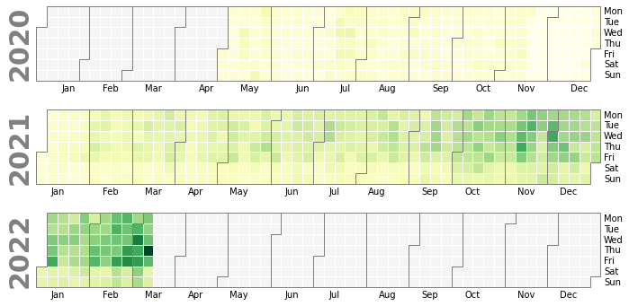

Update repos to disk
####################################

In the following example we download initialize with the username and download the counts from Pypi for the repos.

.. code:: python

	# Import library
	from pypiplot import Pypiplot

	# Download all data for github user.
	pp = Pypiplot(username='erdogant')

	# Update all repos
	pp.update()

	# Update specific repos
	pp.update(repo=['bnlearn','hnet'])

Download Statistics
####################################

Download the statistics from pypi and store on disk.

.. code:: python
	
	# Import library
	from pypiplot import Pypiplot

	# Download all data for github user.
	pp = Pypiplot(username='erdogant')

	# Get total stats across all repos
	results = pp.stats()
	# [pypiplot] >Retrieve files from disk..
	# [pypiplot] >Computing heatmap across the last 360 days.

	# Get some stats
	results = pp.stats(repo=['distfit','pca','bnlearn'])

	print(results.keys())
	# ['data', 'heatmap', 'n_libraries', 'repos']

	# Print data
	print(results['data'])

	#             bnlearn  distfit    pca
	# date                                 
	# 2020-05-01    100.0       18.0  281.0
	# 2020-05-02      6.0        4.0  260.0
	# 2020-05-03     50.0       16.0  126.0
	# 2020-05-04     82.0       64.0   86.0
	# 2020-05-05     64.0      157.0   50.0
	#             ...        ...    ...
	# 2020-09-11    148.0      213.0   78.0
	# 2020-09-12     96.0      102.0  144.0
	# 2020-09-13     12.0       42.0  197.0
	# 2020-09-14    156.0       92.0  244.0
	# 2020-09-15     40.0       76.0  225.0

Calender plot
####################################

Make calender plot with counts.

.. code:: python
	
	# Get stats for all repos
	pp.stats()

	# Plot calender
	pp.plot_cal()

.. table:: Calender plot with ocunts of downloads.
   :align: center

   +----------+
   | |fig1|   |
   +----------+

Interactive Heatmap
####################################

Make heatmap with counts for the last year.

.. code:: python
	
	# Get stats for all repos
	pp.stats()

	# Plot calender
	pp.plot_year()

.. raw:: html

   <iframe src="https://erdogant.github.io/docs/imagesc/pypi/pypi_heatmap.html" height="350px" width="850px", frameBorder="0"></iframe>

Line plot
####################################

Make lineplot with counts.

.. code:: python
	
	# Get stats for all repos
	pp.stats()

	# Make line plot
	pp.plot()

.. |fig2| image:: ../figs/lineplot_all.png

.. table:: Line plot with repos
   :align: center

   +----------+
   | |fig2|   |
   +----------+

Top 10 performing repos
####################################

Gather the top 10 top performing repos.

.. code:: python
	
	# Initialize with username
	pp = Pypiplot(username='erdogant')

	# Get download statistics
	pp.stats()
	
	# Get top 10
	repo=pp.results['data'].sum().sort_values()[-10:].index.values
	
	# Get stats for the top10
	pp.stats(repo=repo)
	
	# Plot
	pp.plot()

.. |fig3| image:: ../figs/lineplot.png

.. table:: Line plot with repos
   :align: center

   +----------+
   | |fig3|   |
   +----------+

Analyze Specific repo
####################################

Here U will demonstrate how to gather stats and make plot for a specific repo.

.. code:: python
	
	# Initialize with username
	pp = Pypiplot(username='erdogant')

	# Get download statistics
	results = pp.stats(repo='bnlearn')
	
	# Plot
	pp.plot()
	pp.plot_cal()
	pp.plot_year()

.. table:: bnlearn
   :align: center

   +----------+
   | |fig4|   |
   +----------+
   | |fig5|   |
   +----------+

Interactive plot with all repos
####################################

Here U will demonstrate how to gather stats for all repos.

.. code:: python
	
	# Initialize with username
	pp = Pypiplot(username='erdogant')

	# Get total stats across all repos
	results = pp.stats()
	
	# Make plot
	pp.plot_heatmap(vmin=10, vmax=2000, cmap='interpolateOranges', title='Total downloads across all repos')

.. raw:: html

   <iframe src="https://erdogant.github.io/docs/imagesc/pypi/pypi_heatmap_full.html" height="600px" width="850px", frameBorder="0"></iframe>

Run pypiplot from terminal
####################################

.. code:: bash

	* "-u", "--username" : username github
	* "-l", "--library"  : library name(s)
	* "-p", "--path"     : path name to store plot.
	* "-v", "--vmin"     : minimun value of the figure.

	python pypiplot/pypiplot.py -u 'erdogant' -p 'C://pypi_heatmap.html' -v '700'

.. raw:: html

	

	

		
	

	

